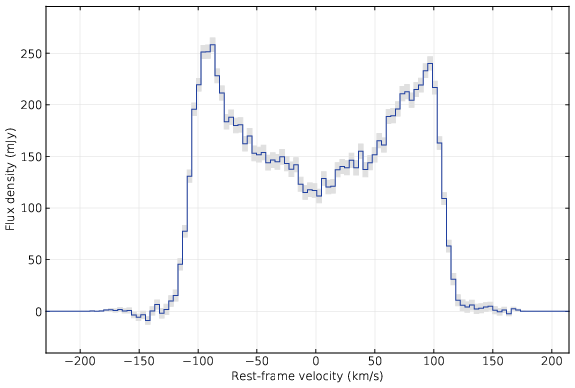

# SpecPlot

## Purpose

The purpose of SpecPlot is to create publication-ready plots of the integrated spectra created by the [SoFiA 2](https://github.com/SoFiA-Admin/SoFiA-2) source finding package. In addition to the spectrum itself, SpecPlot can plot the statistical uncertainties in each spectral channel and automatically convert frequency into recession velocity or source rest-frame velocity.

## Dependencies

* Python 3
* NumPy v1.17 (or higher)
* Matplotlib v3.1 (or higher)

## Usage

`SpecPlot.py <input> <output> [<velo>] [<rms> <beam>] [x_min x_max y_min y_max]`

## Arguments

* `<input>`   Name of the input spectrum created by SoFiA.
* `<output>`  Name of the output plot to be written to disc. Must
              end in '.eps' or '.pdf'.
* `<velo>`    Frequency-to-velocity conversion method. Can be 'cz'
              or 'rest' for recession velocity or source rest-frame
              velocity, respectively.
* `<rms>`     Local rms noise level in the data cube from which the
              spectrum was extracted (in the same units as the flux
              values in the original spectrum).
* `<beam>`    Solid angle of the telescope beam in units of pixels.
* `<x_min>`   Plotting range lower limit in x.
* `<x_max>`   Plotting range upper limit in x.
* `<y_min>`   Plotting range lower limit in y.
* `<y_max>`   Plotting range upper limit in y.

## Description

`<input>` and `<output>` specify the names of the input spectrum
and the output plot, respectively. Both parameters are mandatory.
The output file type will be determined from the file ending and
can either be PDF (file ending `.pdf`) or EPS (file ending `.eps`).

If `<velo>` is specified, then the frequency axis of the spectrum
will be automatically converted to velocity. Possible values
for `<velo>` are `cz` or `rest` for recession velocity or source
rest-frame velocity, respectively. Alternatively, if set to
`freq`, then no conversion will be done. If `rest` is selected,
then the centroid of the spectrum will define v = 0.

`<rms>` and `<beam>` must be specified for any beam correction
to take place and for statistical uncertainties to be plotted as
well. For a Gaussian beam, the solid angle can be calculated
as (π/4) × a × b / ln(2) where a and b are the major and
minor axis in units of pixels.

The `<x_min>`, `<x_max>`, `<y_min>` and `<y_max>` parameters can
be used to specify the plotting range in the actual units in which
the data will appear in the plot. It might be useful to first
leave the range unspecified to check the correct output range
and units before setting the range limits.

## Copyright and licence

Copyright (C) 2021 Tobias Westmeier

SpecPlot is free software: you can redistribute it and/or modify it
under the terms of the GNU General Public License as published by the
Free Software Foundation, either version 3 of the License, or (at your
option) any later version.

This program is distributed in the hope that it will be useful, but
WITHOUT ANY WARRANTY; without even the implied warranty of MERCHANTABILITY
or FITNESS FOR A PARTICULAR PURPOSE. See the GNU General Public License
for more details.

You should have received a copy of the GNU General Public License along
with this program. If not, see http://www.gnu.org/licenses/.
